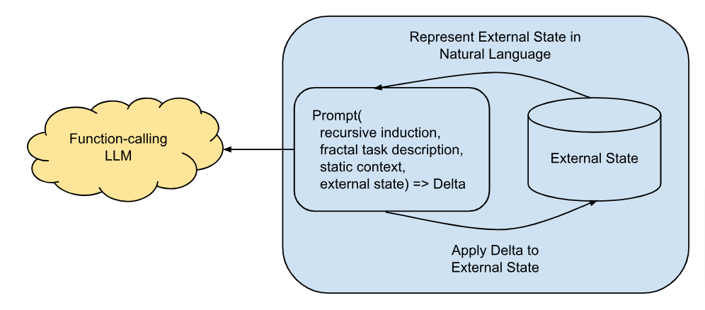

# Fai Deisign.

Fai is built around the principle of fractal recursion. In contrast to traditional software engineering practices that
favor deterministic loops and end points, Fai operates non deterministically over classical and fractal knowledge structures over many timecycles. Each Fai timecycle wraps an identical oneshot call to an LLM injected with a representation of an
externally managed state, which returns a Delta which Fai applies to the external state.

## Recursive Loop Depth
The break case in the recursive loop can come from within the LLM by allowing and responding to a specific function call for "I'm done", or a metric in the state (or injected determinstically) related to a total resource availability for the task, or through deterministic or non-determinsitic analysis of the state through automated or human inspection. In practice some combination of these is used dependent on the circumstance.

## Fractal Deltas vs Assignment
The boundary between neuro-linguistic and deterministic code is chosen as a Delta. The LLM outputs a representation of the potential state change for progressing the state in someway. It is not resonsible for applying the delta or maintaining the state. This differs intentionaly from an assignemnt, or complete rewrite of the state with the previous output. This allows latent information to build up in the state over repeated iterations, within the total context token limit. It also allows for the application of neuro-lingusitic, non deterministic, fractal recursion, to produce exceptionally high quality outputs up to the total token limit.

# Structured Data Formats for Recursive Fractal Systems

# Fractal Data Formats

# Fractal Knowledge Compression and Expansion

# Programming Fai

# Interactive Interfaces
